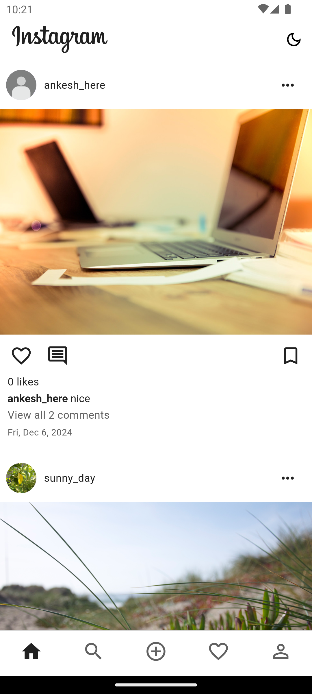
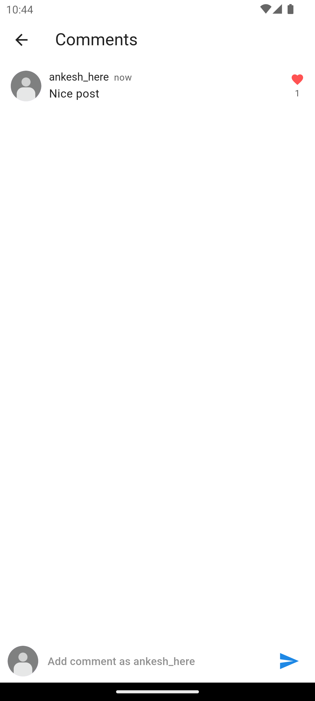
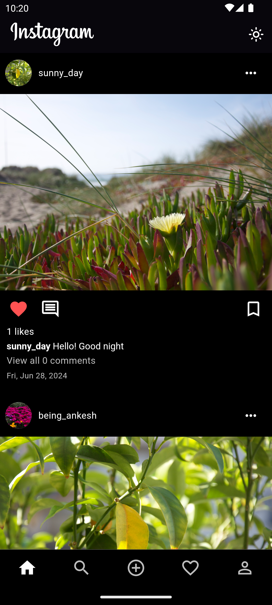
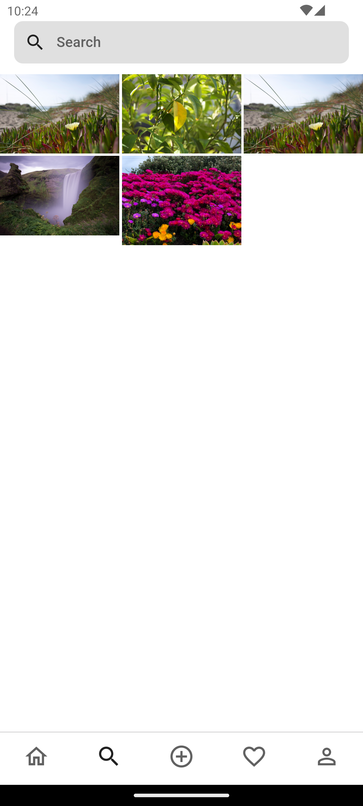

# Description

App name - **Instagram Clone**

BlinkTalk is a full-stack cross-platform Instagram clone app which is made using Flutter.

## Features

- Post, Like, Comment, Search, Follow, Unfollow etc.
- Real-time feeds.
- Supports file-attachment.
- Both light and dark mode support.

## Tech Stack

- Flutter and Dart.
- Firebase Real-time Database (Cloud Firestore), Firebase Storage, Firebase Auth.
- Bloc and Inherited widget for state management.
- Bloc-pattern for architecture and maintainable codebase.
- GetIt for Dependency-injection.
- Shared Preferences for local data storage.

## Screenshots

| HOME TAB                          | PROFILE                      | COMMENTS                     |
| --------------------------------- | ---------------------------- | ---------------------------- |
|  |  |  |

| HOME TAB (DARK)                  | SEARCH TAB                     | ADD POST TAB                    |
| -------------------------------- | ------------------------------ | ------------------------------- |
|  |  |  |
